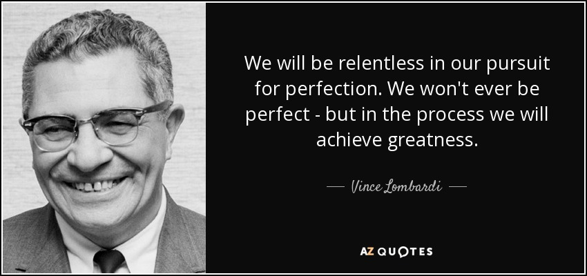

## Welcome

[http://dots.fungible.farm](http://dots.fungible.farm)


Dots.fungible.farm is the repo for fungible.farm documentations & technical specification "dots" (like docs, but more detailed).

You are about to read about adding or making changes, suggesting revisions to the dots repo. 

Fungible.Farm uses a high degree of anti-toil automata & deterministic build process control to maintain technical specifications,
auto-update diagrams, and adapt & track changes using a source code version control system known as git & hosted by an organization known as [github.com](http://github.com) and this is our way of introducing the topic to version-control neophytes who are not software developers.

## 🗣️ Giving Feedback Making/Requesting Changes




To request notifications and/or edit/improve can be done via github.com tools & methods are explained below.

 please either open an issue or submit a PULL request for review. 
 
 Issues are NOT tracked, PULL requests by individuals are conferred contributor status and therefore require an IP license assignment.  If you are with an organization and would like to be completely removed 'wiped' from our plans please open an issue so we have a record and be expected to provide a means to verify your identity &amp; authorization to make such a request.   Please note we will maintain a file & record of all such removal requests as a matter of public record related to the fungible.farm organization. 
 
 Please note due to ISO9001 GIT histories & therefore mistakes are immutable, so we cannot remove the incorrect information from historical tracked & controlled versions other than to issue a retraction and apology (if requested).  Requests to have information removed may be challenged on the grounds of AU [Right to freedom of opinion and expression](https://www.ag.gov.au/rights-and-protections/human-rights-and-anti-discrimination/human-rights-scrutiny/public-sector-guidance-sheets/right-freedom-opinion-and-expression#) or US [First Amendment](https://constitution.congress.gov/constitution/amendment-1/) or by a lower-bar a petitioner may cite why such content is incorrect or violates one or more principles within any of the  codes of conduct voluntarily adopted & broadly adhered to by Fungible.Farm & governance: 
 * [ISO9001:2015 Quality Management Systems](https://academic.oup.com/intqhc/article/30/6/486/4953356)
 * [IETF RFC1087 Ethics &amp; The Internet](https://datatracker.ietf.org/doc/html/rfc1087)
 * [IETF Experiment Ethics & Privacy](https://www.ietf.org/blog/experiment-ethics-and-privacy/)
 * [GIThub.com Codes of Conduct](https://docs.github.com/en/rest/codes-of-conduct)
 * [Microsoft Code of Conduct](https://opensource.microsoft.com/codeofconduct/)
 * [PECB ISO27001 ISO22301 Cybersecurity, responsible disclosure](https://pecb.com/en/pecb-code-of-ethics)
 * [Association for Computing Machinery Code of Ethics](https://www.acm.org/code-of-ethics)
 * [Australian Institute of Company Directors Membership Code of Conduct](https://www.aicd.com.au/content/dam/aicd/pdf/about/about-our-governance/Code%20of%20Conduct%20September%202005.pdf)

Every effort is made to provide accurate and truthful information related to the disposition and aspirational nature of this project. 

The goal(s) of fungible.farm include doing our bit to make humanity better and if we are not aligned and if you're asking us to remove your org from consideration, let's talk first -- we'd certainly much rather be cooperating and keen to correct mistakes or misconceptions.  

Please note this repository will automatically track contributors if you want to submit PULL requests please open an issue first. 😘

## ⚖️ Transparency &amp; Confidentiality, Ethics

Fungible.Farm hopes to operate as a Transparent Organizational Planning.

Nothing is ever perfect, rather WIP means "WIP" in progrss and "DRAFT" refers to anything aspiration in nature. 

HOWEVER because some patents have not been filed (and won't be prosecuted until the machines are built & fully tested & optimized), the information related to future patent methods herein is still intended to be sufficiently vague enough that it doesn't disclose beyond citing papers & providing a reference for the subsequent patent applications as the utility of the inventions which will be assigned.

This serves to act as a defensive mechanism related to future patent challenges for patents that may NEVER be filed. 

Significant contributions to design and questions should be addressed separately and may require participants in such Q&A sessions to accept CONTRIBUTOR roles and potential references/inclusion in future citations &amp; named inventors.

The nature of the internal system within Fungible.Farm contains generative artificial intelligence algorithms G/AI - not "General AI", and constrained into narrow domains & use cases. 

Future plans to release NLU "natural language understanding" AI chat/ops in near future versions is coming with regard to cognitive planned and GIThub provides a "Source of Truth" for [fungible.farm](http://fungible.farm) will reference and incorporate artifacts derived from contents of this document for aligning interactive chatbots, cognitive agents, in machine learning methods incorporation attention & reinforcement learning (GAN/RL). 

##  The http://dots.fungible.farm Layout

🤓: The purpose of d0ts publishing tool is to automate toil explained by [Google SRE Chapter 5 - Eliminating Toil](https://sre.google/sre-book/eliminating-toil/).


All markdown is in the [b00k](/b00k) sub-dir, and [SUMMARY.md](/b00k/SUMMARY.md) provides a map to the left hand navigation on [http://dots.fungible.farm](http://dots.fungible.farm)

Citations are stored in [BIBTEX JSON](/b00k/bibliography.bib) and may be converted from DOI using the [cite-doi.sh](./cite-doi.sh) tool.

The dots content is stored in [Markdown](https://docs.github.com/en/get-started/writing-on-github/getting-started-with-writing-and-formatting-on-github/basic-writing-and-formatting-syntax) with 
[Mermaid](https://mermaid-js.github.io/mermaid/#/) for charts & graphs
and 
[OpenSCad](https://openscad.org/) [CadQuery](https://cadquery.readthedocs.io/en/latest/) for parametric geometry as code, as well as [RUST.🦀](https://github.com/rust-lang/rust), [Typescript.🦄](https://www.typescriptlang.org/), [Python+Poetry.🐍](https://python-poetry.org/) &amp; poly-lingua [WASM.🔮](https://webassembly.org/)   all of which have are built in [git.🐙](https://www.atlassian.com/git/tutorials/what-is-git) & hosted by [github.com](http://github.com), as well as compositional automation in a _not presently simplified_ approach toward
[Literate Programming](https://en.wikipedia.org/wiki/Literate_programming). 

🐧  Git was originally written by Linus Torvalds the inventor & spiritual leader of Linux as a way to coordinate the actions of millions of developers globally working productively on a single project.   Linux runs approximately 96.3% of the top 1 million Internet servers use Linux today and Linux is built with Git.  Fungible.farm using GIT & this [http://github.com/fungible-farm/dots](Dots) repo as a source of truth gives the organization automation super-powers which obviates the need to hire persons in high-low low-automata roles such an [RPA](https://www.cio.com/article/227908/what-is-rpa-robotic-process-automation-explained.html) "robotic process automation" prone popular with ["Silicon valley"](https://www.imdb.com/title/tt2575988/) organizations.  Git is one of many tactical advantages built into the project. 

🦘 : DEAR AUSTRALIANS: Did you knows git software was popularized in corporations globally by an Australian company known as [Atlassian](https://www.atlassian.com/git/tutorials/what-is-git), which at a valuation of $65b USD is the [largest Australian tech company](https://www.spaceship.com.au/learn/what-are-australias-biggest-tech-companies/), more than 2x larger than the next closest competitor Afterpay. 🐨  Atlassian birthed the abomindable GIT SPRINT/SCRUM planning tool known as [JIRA](https://www.atlassian.com/software/jira) that is notorious for "top/down" non-agile waterfall-prone organizational 'time-boxed' structures that usually generate bad undocumented non-literate code. 🤮 Australians and more generally [APAC](https://www.devopsinstitute.com/global-perspective-of-devops-particularly-in-the-apac-j-region-with-dheeraj-nayal-e11/) are found in every survey to be late adopters of Git software such that more people in the corporate world "know JIRA" than "know GIT", and that their [Atlassian Confluence](https://www.atlassian.com/software/confluence) does far-less and requires paid-per-user licensing whereas this fungible.farm mdbook tool is build on free & open software that would cost hundreds of dollars per month per user that this 'dots' software & build actions does for free.  [Mike Cannon Brookes, Atlassian Founder](https://en.wikipedia.org/wiki/Mike_Cannon-Brookes) &amp; [Grok Ventures](https://fundcomb.com/funds/grok-ventures) which does visionary level impact investments and is therefore somebody with whom I have immense respect.  But an investment from Grok toward Fungible.Farm the organization is perhaps the only circumstance where I would organizationally consider using Atlassian Products (if the licenses were free). 😜   If you are an organization which uses Atlassian Confluence and/or JIRA can be integrated with Github as a remote and it should *mostly* work fine. 

The 'dots' publishing engine is [mdbook](https://rust-lang.github.io/mdBook/), with [toc](https://github.com/badboy/mdbook-toc) [admonish "material design for mdbook"](https://tommilligan.github.io/mdbook-admonish/) and [svgbob](https://ivanceras.github.io/svgbob-editor/) for diagrams & illustrations, and at a certain point it's probably inevitable that either [MathJax](https://rust-lang.github.io/mdBook/format/mathjax.html) and/or Latex [1](https://latex-cookbook.net/) [2](https://www-cs-faculty.stanford.edu/~knuth/lp.html) will also *likely* to appear in future versions as well as a PUBLISH TO PDF at end of epoch "work period" for [arxiv.org](https://arxiv.org/) & [DOI](https://www.doi.org/registration_agencies.html) *someday* 🤞. 


## Ways to get involved/participate

* sign up for [github.com](https://github.com/) _free_ opensource developer tool owned by microsoft, git the underlying tool is a ubiquitous version-control tool in the field of software engineering. 

* star/watch the repo, or find files & directories github provides feeds that can do this for both directories (such as "b00k") and specific files (such as CEAT.md) or whatever files/directories an individual might want to track can be provided both as 'present','history' or Atom feed using the steps provided below:
    * https://stackoverflow.com/questions/9732779/how-to-watch-only-a-directory-in-a-github-repository
 
* A FUTURE method will run open to [vscode.dev]http://vscode.dev (a Microsoft developer environment / texteditor) with full tooling will be provided in a VS Code Remote Development Container Environment[1](https://code.visualstudio.com/docs/remote/remote-overview)
[2](https://github.com/fungible-farm/vscode-dev-containers)

* if git & github, vscode.dev is 'technically too much in the "hard basket"' all affore mentioned methods are 👎 and there is organizational requirement to have .DOC or .PDF or Google Doc generated, or changes voice-synthensized into a sound file and emailed then please open an issue and it will go on the backlog for automated build-actions. 

* 🤓 GIT enjoys a hefty lead greater than 70% of all software built globally use git, it is an incredibly powerful tool.

* further "bot automation" for things like calendaring, contacting, etc. 

## @b's notes related to build this repo


uses ff-rust-musl-builder

```bash
 alias ff-rust-musl-builder='docker run --rm -it -v "$(pwd)":/home/rust/src elasticdotventures/ff-rust-musl-builder'
 ff-rust-musl-builder mdbook build
```

DOCKER_BUILDKIT=1 docker build -t elasticdotventures/fungiblefarm-dots --build-arg BUILDKIT_INLINE_CACHE=1 .
 docker buildx build --cache-to=user/app:cache .


# References 
 * https://github.com/rust-lang/mdBook/wiki/Automated-Deployment%3A-GitHub-Pages
 * https://github.com/elasticdotventures/fungiblefarm-mdbook/settings/pages
 * https://docs.github.com/en/packages/learn-github-packages/connecting-a-repository-to-a-package


## TODO
* need to enhance mermaid with svg's
* need to add ability to embed python
* need to add ability to run typescript examples in mdbook. 
* need to add ability to embed cad query - geometry as code

* https://github.com/jontze/action-mdbook
* https://www.npmjs.com/package/mdbook-nodejs-preprocessor-builder
* https://lib.rs/crates/mdbook-fs-summary

## to install modules from scratch
⚠️ this should be explicitly necessary if you are using the devcontainer.json

cargo install mdbook
cargo install mdbook-bib
cargo install mdbook-toc mdbook-mermaid
mdbook-mermaid install

cargo install svgbob
cargo install svgbob_cli
cargo install mdbook-svgbob
cargo install mdbook-open-on-gh

https://github.com/tommilligan/mdbook-admonish


## FUTURE Latex & PDF

https://www.ctan.org/pkg/biblatex

{{#cite and }}

https://www.overleaf.com/learn/latex/Learn_LaTeX_in_30_minutes

\documentclass{article}

\begin{document}
First document. This is a simple example, with no 
extra parameters or packages included.
\end{document}
https://docs.github.com/en/actions/using-github-hosted-runners/about-github-hosted-runners#docker-container-filesystem

